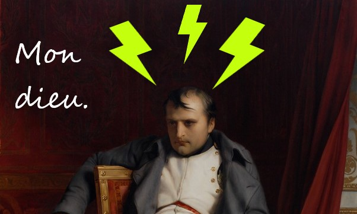

# Napoleon's Migraine

It's said that the French statesman and military leader Napoleon Bonaparte (1769-1821) [suffered from terrible migraines](https://www.washingtonpost.com/archive/lifestyle/wellness/1994/12/20/migraines-torment-the-worst-in-the-world/581d8895-11c0-4484-959a-30713ec325e7/) during his military campaigns. The cause of these migraines is unknown.

This program asks the question: What if Napoleon suffered from barometric pressure migraines - that is, migraines that are triggered with barometric pressure changes? Is it possible that such migraines could have contributed to his rare defeats? On this basis, the program compares Napoleon's battle outcomes with barometric pressure changes in the battle region at the time of the battle to see if his losses might be correlated with migraine weather. 

If you run these files, you end up producing a chart of Napoleonic battle dates vs. pressure deltas between the start/end date of each battle. The chart is annotated with the rare battles in which Napoleon was defeated (yes, including Waterloo! :). Typically, a decrease in barometric pressure will cause head pain. If there were a strong correlation between barometric pressure drops and battle dates, we might be onto something.

This program was intended as a fun Python learning project for me, and it's [rapturously unscientific](#Caveats).

## Prerequisites
Before running this program, install the following packages using the provider's documentation. Versions listed were the ones the program was tested on.
* Python 3 (testing was done on Python 3.9.5), which includes:
  * sqlite3
  * ssl
* bs4 (BeautifulSoup 4.9.3)
* matplotlib 3.4.2
* numpy 1.20.3
* pandas 1.2.4

## To run Napoleon's Migraine
Run the files in this order:
1. napoleonsmigraine.py
1. haversine.py
1. correlation.py
1. visualization2.py

What these files do:
* _napoleonsmigraine.py_: Pulls and processes historically reconstructed barometric data from CDAIC site and inserts it into sqlite database called barometer.sqlite. Next, it pulls Napoleonic battle data from Wikipedia, processes it, and stores it in sqlite.
* _haversine.py_: Uses the Haversine Formula to find the smallest distance between the battle location (from Wikipedia) and the barometric station (from CDAIC). Stores the closest station to the battle in the Battles table of the database.
* _correlation.py_: For each battle, finds the barometric pressure in the month before the battle started and the month the battle ended. Saves the pressurestart and pressureend data in the database and creates a view v_migraine_data of pressure and battle data. 
* _visualization2.py_: Creates a lollipop (scatter) plot of the delta of pressures between battle start and battle end. The chart shows "defeat" annotations to help the viewer test the hypothesis, "Is it possible that Napoleon's migraines could have contributed to his rare defeats?" Run the program and find out! :)

## Caveats
As mentioned, this is just a fun project with no scientific validity. Here are some of the ways the methodology is, shall we say, questionable:
* Online sources say Napoleon suffered from migraines. However, we do not know what kind of migraines they were. This program assumes they might have been barometric pressure migraines - that is, migraines that occur when the barometric pressure changes. As there are many different migraine causes, Napoleon may well have not suffered from this specific type.
* Barometric pressure tends to change day by day, and hence barometric pressure migraines would tend to be affected more by daily weather than by monthly weather. However, the availability of daily barometric readings for the dates and areas covered by Napoleonic battles is scant. The program therefore uses historical reconstructions of monthly mean pressure. Not only is the pressure data on a scale of months rather than days, as would typically affect a barometric pressure migraineur, but that monthly pressure data represents the average, so it's rather suspect on an individual health scale.
* In some cases, battles lasted months. This program only looks at the barometric pressure readings for the month before the start of the battle and the reading for the ending month of the battle. Again, scale is a factor here.
* The program assumes that Napoleon was solely responsible for the battles listed as part of his campaigns on Wikipedia. However, other generals were sometimes in command or involved. Therefore, it's unlikely that Napoleon having a migraine during the planning of any particular battle would result in defeat.
* There are many reasons for winning and losing battles. Even if there were a perfect match of pressure changes to battle losses, the real reason(s) for losing a battle could be other than migraine (for example, during the Battle of La Rothière, the weather was terrible, causing Napoleon's artillery to be useless and the soldiers to get lost).
* The program approximates the closest barometric pressure readings ("stations" as they're called in this program) to battle sites. The scale of the data is such that these stations can sometimes be located pretty far from the site of a battle.
* Additionally, the station/battle pairing doesn't take into account local weather patterns or even the elevation at which a battle took place. For example, if the battle was high in the mountains, the pressure might be lower than at sea level. Even [small differences (5 mbars or hPa)](https://techsensitive.com/japanese-researchers-find-correlation-between-changes-in-atmospheric-pressure-and-migraines/) in pressure may cause migraines.

## Data Sources
### Historically reconstructed mean barometric pressure data for Europe (1780-1980)
Jones P D ; Wigley T M L ; Briffa K R (2018): Monthly Mean Pressure Reconstructions for Europe (1780-1980) and North America (1858-1980) (1987) (NDP-025). Carbon Dioxide Information Analysis Center (CDIAC), Oak Ridge National Laboratory (ORNL), Oak Ridge, TN (United States). doi:10.3334/CDIAC/CLI.NDP025

### Wikipedia
En.wikipedia.org. 2021. Military career of Napoleon Bonaparte - Wikipedia. [online] Available at: <https://en.wikipedia.org/wiki/Military_career_of_Napoleon_Bonaparte#Battle_record_summary> [Accessed 11 August 2021].

## Other Reading
* [Influence of Barometric Pressure in Patients with Migraine Headache](https://www.jstage.jst.go.jp/article/internalmedicine/50/18/50_18_1923/_pdf) (PDF)
* [Japanese researchers find correlation between changes in atmospheric pressure and migraines](https://techsensitive.com/japanese-researchers-find-correlation-between-changes-in-atmospheric-pressure-and-migraines/)
* [Understanding Barometric Pressure Headaches: How Does Weather Affect Your Headaches?](https://www.healthline.com/health/headache/barometric-pressure-headache)
* [Weather and Migraine](https://americanmigrainefoundation.org/resource-library/weather-and-migraine/)
